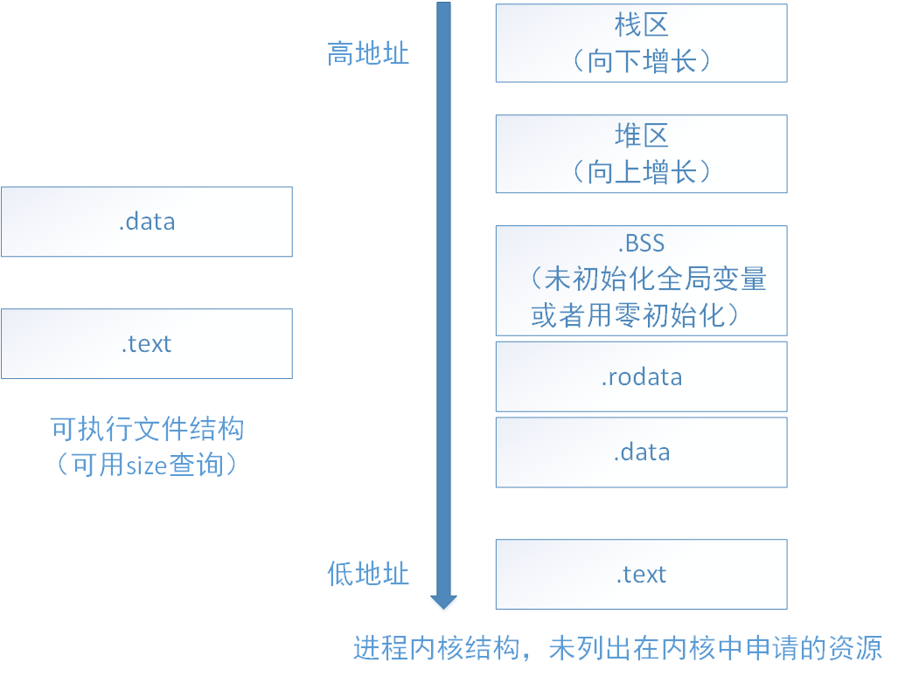

<!--
 * @Author: Vanish
 * @Date: 2024-10-19 10:51:44
 * @LastEditTime: 2024-11-12 20:17:34
 * Also View: http://vanishing.cc
 * Copyright@ https://creativecommons.org/licenses/by/4.0/deed.zh-hans
-->
# 1.malloc,free,new,delete 的区别

## 答案

在C/C++中，malloc和free是标准库函数，用于手动管理内存，而new和delete是C++运算符，提供更高级的内存管理。new会自动计算所需内存、返回对象类型指针，并在分配失败时抛出异常，还会调用构造函数；而malloc则需手动计算内存、返回void*指针，并在分配失败时返回NULL。释放内存时，delete会调用析构函数，而free则不会.


## 背景

- malloc,free 是C/C++的标准库函数，用来分配和释放内存。
- new,delete 是C++的运算符，用来分配和释放内存。

## 差别

- new 自动计算需要分配内存大小,malloc需要手动计算
- new 返回对象类型指针,mallock返回void* 需要手动类型转换
- new 分配失败抛出异常,malloc分配失败返回NULL
- new 调用构造函数,malloc需要手动调用构造函数
- new 在free store(自由存储区)上分配内存,malloc在堆上分配内存
- delete 需要对象类型指针,free需要void* 
- delete 调用析构函数,malloc需要手动调用析构函数

## 知识补充

- new的步骤 
  - operator new
  - 申请足够的内存
  - 调用构造函数,初始化成员变量
- delete的步骤
  - 调用析构函数
  - operator delete
  - 释放内存

## 相关问题

- malloc是怎么分配空间的?
- malloc分配的是物理内存还是虚拟内存?
- malloc调用后是否立刻得到物理内存?
- free(p)如何知道该释放多大空间?

# 2.简述多态实现原理

## 答案
所谓多态，就是同一个函数名具有多种状态，或者说一个接口具有不同的行为.
C++的多态分为编译时多态和运行时多态.
编译时多态通过重载和模板来实现.
运行时多态通过继承和虚函数来实现.

## 知识背景

[多态实现原理](简述多态实现原理.km)

# 3.C++内存布局

## 答案

## 知识背景

C++内存区域:
- 堆: 使用 malloc free分配的空间
- 栈
- 静态存储区: 存储全局变量和静态变量
- 常量存储区: 存储常量
- 自由存储区: new delete 分配的空间


- .text段:编译后程序主题,aka程序的机器指令
- .data段:初始化非零的全局变量,静态变量
- .rodata段:只读数据,例如字符串常量
- .bss段:未初始化的全局变量,被初始化为0的全局变量
- heap:动态分配的内存,向高地址方向增长
- stack:函数调用栈,向低地址方向增长

堆和栈的区别:

- 管理方式:栈自动管理,堆手动管理
- 空间大小:栈大小固定,堆大小可变
- 碎片问题:栈内存无碎片,堆内存容易产生碎片
- 生长方向:栈向低地址增长,堆向高地址增长
- 分配方式:堆都是动态分配的,栈有两种分配方式:静态分配和动态分配,其中静态分配由编译器完成的,动态分配由alloca函数完成.且栈的动态分配由编译器完成,无需手工实现.
- 分配效率: 栈效率高,堆效率低.计算机底层支持栈,堆的实现依靠c/c++函数库
### tips

- 虚函数表存放在 .rodata段

# 4.虚函数表和虚函数表指针的创建时机

## 答案
虚函数表编译时创建.
虚函数表指针在类对象构造时创建.

## 知识背景

虚函数是通过虚函数表来实现的，虚函数表包含了一个类(所有)的虚函数的地址，在有虚函数的类对象中，它内存空间的头部会有一个虚函数表指针(虚表指针)，用来管理虚函数表。
当子类对象对父类虚函数进行重写的时候，虚函数表的相应虚函数地址会发生改变，改写成这个虚函数的地址，当我们用一个父类的指针来操作子类对象的时候，它可以指明实际所调用的函数

- 虚函数表: 存放于类中,记录函数地址.
- 虚函数表指针: 存放在对象中,指向虚函数表的起始地址.

虚函数表的创建时机: 编译时

虚函数表指针的创建时机: 类对象构造时

有继承情况下虚函数表指针赋值过程:
- 1.调用父类构造函数,把A的虚函数表地址赋值给vptr
- 2.调用子类构造函数,把B的虚函数表地址赋值给vptr

# 5.进程和线程的区别

## 答案

- 进程是运行时的程序,是系统进行资源分配的基本单位,它实现了系统的并发.
- 线程是进程的子单位,是CPU调度的基本单位,也是独立运行的基本单位,它实现了进程内部的并发
- 一个程序至少拥有一个进程,一个进程至少拥有一个线程.
- 进程有独立的内存空间,线程共享进程的内存空间.
- 线程间的信息共享和通讯比较方便,不需要资源的切换.

## 概念

- 进程是资源分配的基本单位
- 线程是cpu调度的基本单位

## 区别

- 本质区别: 进程是资源分配的基本单位,线程是cpu调度的基本单位
- 内存: 进程有独立的虚拟内存空间,线程没有
- 所属关系: 一个线程只能属于一个进程,一个进程可以有多个线程
- 健壮性: 进程之间互不影响,线程崩溃会导致进程崩溃
- 并发性: 进程切换效率低,线程切换效率高


<!-- TODO: 这一节还不算完善 -->
# 6.左值,右值,移动语义

## 答案

- 左值有地址,右值没地址.
- 右值引用是为了支持移动操作而引出的一个概念,它只能绑定到一个将要销毁的对象,使用右值引用的移动操作可以避免无谓的拷贝,提高性能。使用std::move()函数可以将一个左值转换为右值引用.
- 移动构造函数需要传递的参数是一个右值引用，移动构造函数不分配新内存，而是接管传递而来对象的内存，并在移动之后把源对象销毁；拷贝构造函数需要传递一个左值引用，可能会造成重新分配内存，性能更低

## 左值和右值的定义

- 左值有地址,右值没地址
- 左值能读能写,右值只读不写
```cpp
int GetRVal()
{
  return 10;//返回一个右值
}

int& GetLVal()
{
  static int a = 10; //左值必须有地址
  return a;
}

void SetValueR(int value){}
void SetValueL(int& value){}

void PrintName(string& name){}
void PrintNameR(string&& name){}//两个& 表示接受一个右值引用

int main()
{
  int i = 10;
  10 = i; //错误的: 10是右值没有地址,所以不能赋值  

  int a = GetRVal();
  GetRVal() = 5; //错误的: 右值不能被赋值

  GetLVal() = 5; //正确的: 左值可以被赋值

  SetValueR(i); 
  SetValueR(10);
  SetValueL(i);
  SetValueL(10); // 错误的

  int& value = 10; // 错误的: 右值没有地址,不能绑定到左值引用
  const int& value2 = 10; // 正确的: 右值没有地址,但是可以绑定到常量左值引用(编译器支持)

  string firstName = "QC"
  string lastName = "X"; 
  string fullName = firstName + lastName;

  PrintName(fullName);
  PrintName(firstName + lastName); // 错误的: +会生成一个临时变量(右值)
  PrintNameR(fullName); // 错误的: 左值不能传递给右值引用
  PrintNameR(firstName + lastName); // 正确的: 右值可以传递给右值引用
}

```

## 移动语义

为什么要移动语义:
- 减少复制开销


## 三/五法则

如果特殊定义了以下任何一个函数:
- 析构函数
- 拷贝构造函数
- 拷贝赋值运算符
- 移动构造函数
- 移动赋值运算符

那么你应该定义所有五个函数.

## 万能引用

模板中的&&表示万能引用,可以绑定任意类型的左值或右值.例如:
```cpp
template<typename T>
void func(T&& param){//万能引用

int main()
{
  int a = 10;

  func(a);
  func(10);
  func(std::move(a));
}
```

## 引用折叠

<Effective Modern C++> 书中提到:
- 所有的引用折叠最终都代表一个引用,要么是左值引用,要么是右值引用.

规则是:
- 有任意一个引用是左值引用,则折叠结果是左值引用.

## 完美转发

```cpp
template<typename T>void func(T&t){cout<<"左值引l用"<<endl;}
template<typename T>void func(T &&t){cout<<"右值引l用"<<endl;}
template<typename T>void func1(T &&t){ func(forward<T>(t));}
```

# 7.内联函数与宏

## 答案

- 内联函数作用是在函数调用点上展开函数,避免函数调用开销
- 内联函数缺点是造成代码膨胀;编译时间增加.
- 宏是在预处理阶段对命令的替换,inline是在编译阶段在函数调用点处展开.
- define不会对参数类型进行检查,会出现类型安全问题.
- 使用宏需要可能会有很多括号,容易出错.

# 8.智能指针

## 答案

## 指针管理的困境

1. 资源释放了,指针没有置空
   - 野指针:指针指向的地址已经被释放,但是指针仍然指向这个地址
   - 悬垂指针:一般是多个指针指向同一地址,有一指针释放了资源,别的就成了悬垂指针
2. 没有释放资源,内存泄漏
   - 忘了delete或者没有执行delete,导致内存泄漏
3. 重复释放资源,引发coredump

## RAII思想

RAII(Resource Acquisition Is Initialization)是一种编程思想,它认为资源的获取和初始化是同一过程,资源的生命周期由资源管理器来管理,资源管理器在构造函数中申请资源,在析构函数中释放资源.

更通俗地说就是:利用对象的生命周期来控制程序资源,在构建时申请资源,在销毁时释放资源.

## 智能指针种类

- shared_ptr: 共享指针,允许多个指针指向同一资源,引用计数记录指向资源的指针数量,当最后一个指针被销毁时,资源被释放.
- unique_ptr: 独占指针,只能有一个指针指向资源,当指针被销毁时,资源被释放.
- weak_ptr: 弱指针,指向shared_ptr管理的资源,但是不影响shared_ptr的引用计数.

## weak_ptr作用

- 表面上:防止循环引用
- 深层次:weak_ptr持有者不应该对对象的生命周期有影响.

## 智能指针的使用

除非需要手动管理内存,否则应该尽量使用智能指针.

优先级: unique_ptr > shared_ptr

# 9.死锁

## 死锁产生的条件

1. 互斥:只有对必须互斥使用的资源进行争抢才能导致死锁
2. 不可剥夺:进程在获得资源未使用完前,不能由其他进程强行夺走资源
3. 请求和保持:进程至少保持了一个资源,但又提出了新的请求
4. 循环等待:存在一种资源的循环等待链

**发生死锁时一定有循环等待,但是发生循环等待时未必死锁**

## 死锁的处理策略

1. 预防死锁:破坏四个条件之一,使死锁不发生
2. 避免死锁:用某种策略,使进程不会陷入死锁状态(银行家算法)
3. 死锁的检测与解除:允许死锁发生,但是系统能够检测到死锁发生,并解除死锁
<!-- 
## 预防死锁

1. 互斥: 将互斥使用资源变成可共享资源
   
   缺点: 可行性可能不高
2. 不可剥夺: 
   
   a. 当某进程请求资源无法满足时,必须立即释放已获得的资源,待以后需要时重新申请
   
   b. 当申请资源被占有时,由系统协助,强行获得资源.
   
   缺点: 
    1. 实现较复杂
    2. 释放已有资源导致前一阶段工作失效,浪费资源.
    3. 反复申请释放增加开销
    4. 方案一可能导致进程饥饿
3. 请求和保持:在进程运行前一次申请完它需要的所有资源,未满足前不让其投入运行.
   
   缺点: 严重浪费资源;可能导致某些进程饥饿.
4. 循环等待: 顺序资源分配法:给资源编号,每个进程必须按编号递增的顺序请求资源.
   
   缺点: 实现复杂;不方便增加新资源;进程使用资源顺序与递增顺序不一就会导致资源浪费.

## 避免死锁
 -->


# 10.C++ 11 新特性


# 11.C++中function ,lambda,bind的关系

## 答案

- function是一个模板类,用于封装可调用对象,可以作为函数参数,返回值
- lambda:是匿名函数,即没有名字的函数
- bind: 函数适配器,可以将一个函数和参数绑定,生成一个新的函数对象.

## 区别

- function: 模板类
- lambda: 匿名函数
- bind: 函数适配器

## std::function

由于C++中可调用对象太多,比如函数、函数指针、成员函数指针、lambda表达式等,因此C++11中引入了std::function模板类,用来封装函数对象.

1. function是C++11中新增的模板类,用来封装可调用对象
2. function抽象了函数参数,函数返回值

示例
```cpp
function<void(int,int)> sum = [](int x, int y) -> void { return x + y; };
```

原理:
1. 动态绑定

## lambda表达式

lambda是一个方便创建匿名函数的语法糖

示例:
```cpp
auto f = [](int x, int y) -> void { return x + y; };
```

构成:
- [] 捕获列表: 捕获外部作用域的变量
  - 值捕获: [outVal] 按值捕获, 只读不写.可使用mutable修饰符在闭包内修改变量.
  - 引用捕获: [&outVal] 按引用捕获, 捕获外部作用域的变量, 按引用传递给lambda函数
- () 参数列表: 声明函数参数
- -> 返回类型: 声明函数返回值类型,可省略,因为有类型推导.
- {} 函数体: 定义函数体

## std::bind

通过绑定函数以及函数参数的方式生成闭包.

示例:
```cpp
int add(int x, int y) { return x + y; }

auto f = bind(&add, 1, 2);
cout<<f()<<endl// 3
auto g = bind(&add, 1, placeholders::_1);
cout<<g(1)<<endl// 2
```


# 12.虚析构函数作用

## 答案

为了使子类析构函数能够正常调用,需要将基类设置为虚析构函数.

## 原理

如果非虚析构函数,子类对象赋值给基类指针,调用析构函数时,子类对象析构函数得不到调用.